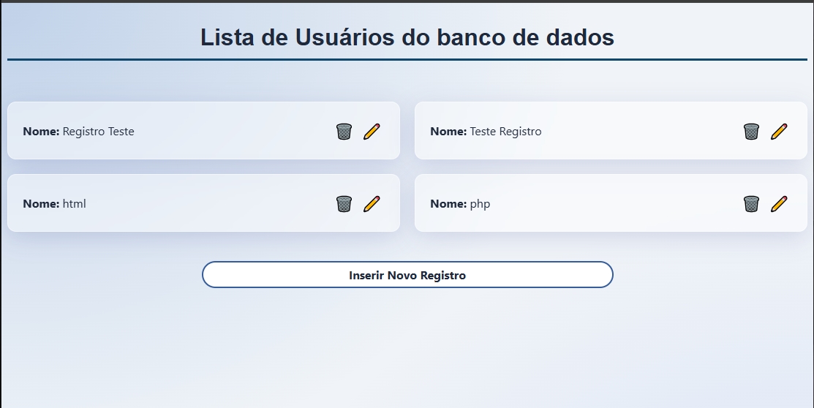
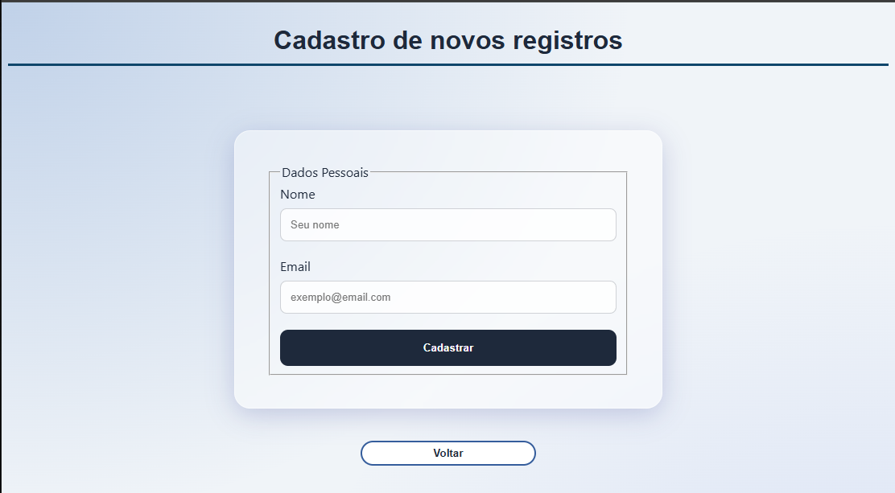
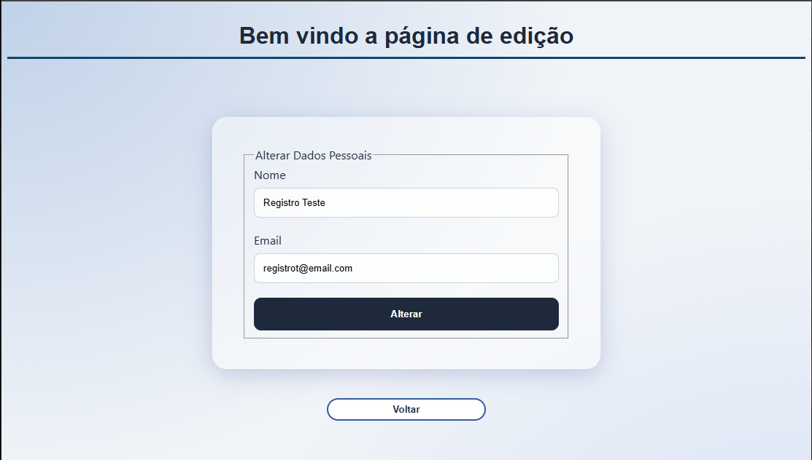
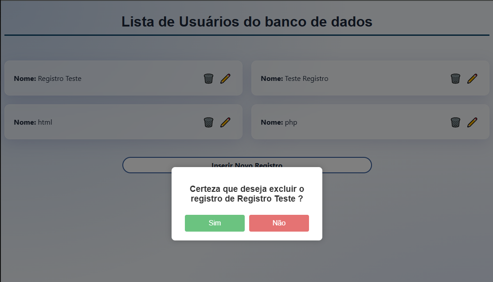
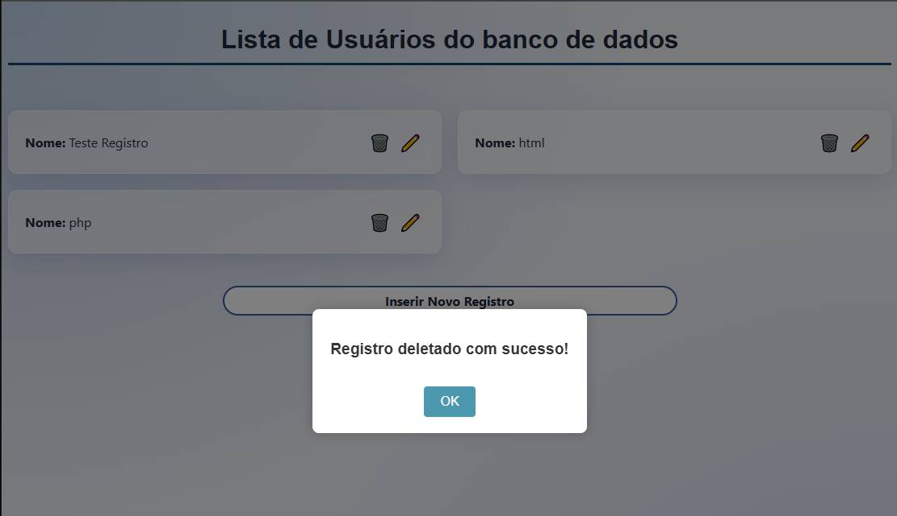
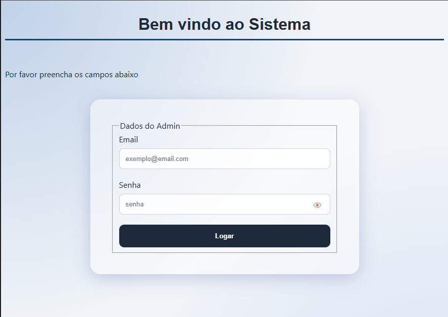
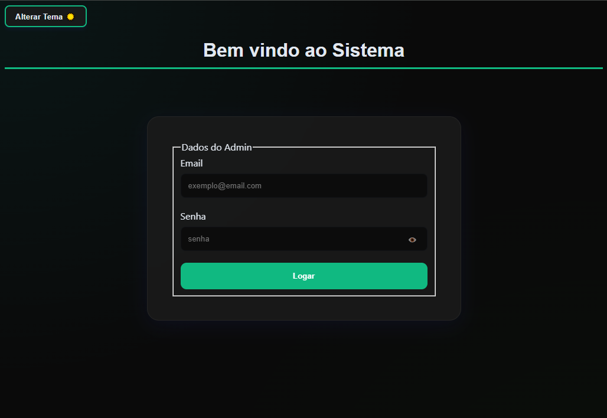

# ⚡ User Admin Panel - Gerenciamento Fullstack


Este projeto é um **Painel Administrativo v1.0** desenvolvido para consolidar conhecimentos em comunicação assíncrona entre o Front-end e o Back-end. O foco principal foi sair da teoria e implementar um fluxo de dados real utilizando **Vanilla JS** e **PHP PDO**.

## 📂 Estrutura do Projeto

A arquitetura foi desenhada seguindo princípios de **Separação de Responsabilidades (SoC)**, organizando a lógica de dados, endpoints e interface:

- **api/**: Endpoints responsáveis pelo processamento das ações (Insert, Update, Delete).
- **config/**: Arquivos de configuração e conexão com o banco de dados via PDO.
- **data/**: Scripts de recuperação de dados (Listagem e busca por ID).
- **helpers/**: Funções auxiliares para padronização de respostas JSON e autenticação.
- **index.php**: Ponto de entrada principal que renderiza a interface e a listagem via SSR.
- **.env**: Gerenciamento de variáveis de ambiente para credenciais do banco de dados.
- **assets/**: Recursos estáticos (CSS, JS, Imagens).

## 📸 Demonstração do Painel

O sistema conta com uma interface moderna e responsiva, utilizando efeitos de desfoque para uma experiência de usuário limpa e intuitiva.

### 🖥️ Visão Geral e Listagem



### 📝 Fluxo de Cadastro e Edição

<p align="center">
  
  
</p>

### 🗑️ Sistema de Exclusão

<p align="center">
  
  
</p>

## 🚀 Como Rodar Localmente

Siga os passos abaixo para configurar o projeto em sua máquina:

### 1. Pré-requisitos

Certifique-se de ter um servidor local instalado (ex: **XAMPP**, **WAMP** ou **Laragon**) com suporte a **PHP 8.x** e **MySQL**.

### 2. Clonar o Repositório

Navegue até a pasta `htdocs` do seu servidor local e execute:

```bash
git clone https://github.com/devls-io/user-admin-panel.git
```

### 3. Configurar o Banco de Dados

1. Acesse o **phpMyAdmin** ou seu cliente MySQL de preferência.
2. Crie um banco de dados (ex: `user_admin_db`).
3. Execute o script SQL abaixo para criar a tabela de usuários:

```sql
CREATE TABLE usuarios (
    id INT AUTO_INCREMENT PRIMARY KEY,
    nome VARCHAR(100) NOT NULL,
    email VARCHAR(100) NOT NULL UNIQUE,
    created_at TIMESTAMP DEFAULT CURRENT_TIMESTAMP
);
```

### 🔑 4. Variáveis de Ambiente

Certifique-se de ter o [Composer](https://getcomposer.org/) instalado e, na raiz do projeto, execute:

```
composer install
```

Crie um arquivo `.env` na raiz do projeto e preencha com suas credenciais locais para que o motor do PHP consiga se conectar ao MySQL:

```env
# Configurações do Banco de Dados
DB_HOST=localhost
DB_PORT=3306
DB_NAME=nome_do_banco
DB_USER=root
DB_PASS=sua_senha
```

### 🔑 5. Criando o Usuário Administrador

Como o sistema agora possui proteção de rotas, você precisará de uma conta de administrador para acessar o painel:

1. Acesse a pasta `data/` pelo terminal ou navegador.
2. Execute o arquivo `gerar_admin.php`.
3. O script irá gerar automaticamente o usuário padrão definido no arquivo (utilizando `password_hash`).

## 🛡️ Segurança e Validações

O projeto foi construído com foco em integridade de dados e boas práticas de segurança:

- **Prevenção de SQL Injection**: Uso obrigatório de **PHP PDO com Prepared Statements** em todas as interações com o banco de dados.
- **Sanitização de Dados**: Validação rigorosa de e-mails via `filter_var` e proteção contra IDs inexistentes ou inválidos.
- **Variáveis de Ambiente**: Credenciais sensíveis isoladas em arquivo `.env` para evitar exposição no controle de versão.

## 🆙 Últimas Atualizações

### **Versão 1.1 - Março/2026**

Nesta versão, o foco foi a implementação de uma camada de autenticação e melhorias na experiência do usuário (UX):

- **Sistema de Login**: Implementação de autenticação de administradores com sessões seguras e proteção de rotas via PHP. [cite: 2026-02-19]
- **Segurança de Senhas**: Uso de `password_hash` e `password_verify` para armazenamento seguro de credenciais. [cite: 2026-02-19]
- **Refatoração UI/UX**:
  - **Visibilidade de Senha**: Adicionada alternância de visibilidade (ícone de olho) utilizando JavaScript puro e manipulação de DOM. [cite: 2026-02-19]
  - **Transição de Páginas**: Implementação de transição suave (_fade-in_) entre páginas via CSS para uma navegação mais fluida e profissional. [cite: 2026-02-19]
- **Organização de Código**: Reestruturação completa das pastas para garantir a separação de responsabilidades (SoC). [cite: 2026-02-19]



### **Versão 1.2 - Março/2026 (Atual)**

Nesta atualização, o foco foi a personalização da interface, refinamento na persistência de dados e estabilidade da API:

- **Sistema de Temas Dinâmicos**: Implementação de _Light Mode_ e o exclusivo tema _Deep Forest_ (Dark Mode), com alternância via JavaScript e persistência via **Cookies PHP**, garantindo que a preferência do usuário seja mantida entre sessões.
- **Design System com CSS Variables**: Refatoração completa das folhas de estilo para utilização de variáveis globais, facilitando a manutenção e a escalabilidade das cores e componentes.
- **Componentização com PHP**: Transformação da lógica do botão de tema em um componente reutilizável (`helpers/theme.php`), seguindo o princípio **DRY (Don't Repeat Yourself)**.
- **Estabilidade da API (Hotfix)**: Correção de bug crítico na lógica de atualização (`UPDATE`), tratando retornos nulos e evitando erros de _undefined_ quando o formulário é enviado sem alterações.
- **Transições de Interface**: Adição de transições suaves (`transition: background-color 0.4s`) para as trocas de estado de cores, elevando a percepção de qualidade da UI.


